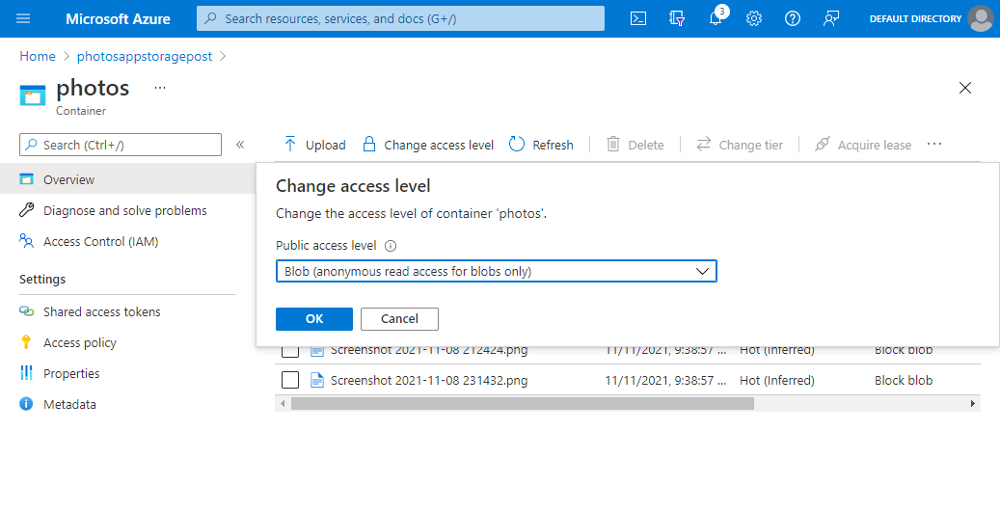
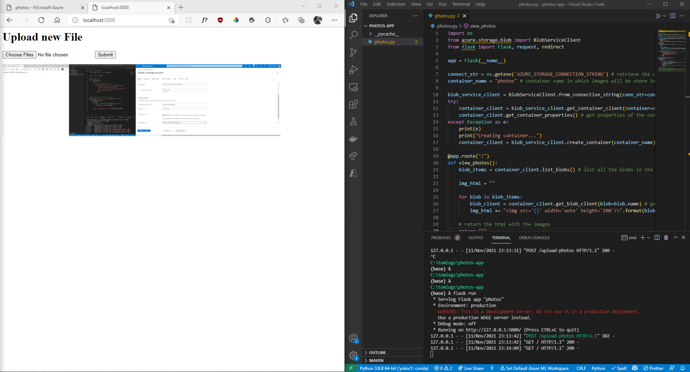

Photos are precious: they encapsulate memories, and looking at them brings joy. It makes sense to want to back them up on a web application. This would also make it easy to view and share pictures on any device, since the application would be accessible through any web browser.

In this blog post, we are going to build a Python web application from scratch, using the Flask framework and we will use Azure Blob Storage to store our pictures. Let's get started!

Prerequisites:

* Python 3.8.5 ([https://www.python.org/downloads/](https://www.python.org/downloads/ "https://www.python.org/downloads/"))
* Flask 1.1.2 ([https://flask.palletsprojects.com/en/2.0.x/](https://flask.palletsprojects.com/en/2.0.x/ "Flask"))

## Part 1: Upload photos

### Create a form upload to upload photos

We'll start off by creating a simple Flask application with an upload form. This is where we will be uploading our pictures. The first endpoint will have a "/" route.  This endpoint will return HTML with a form to upload photos. (Eventually, we will display the uploaded pictures on this page). We'll define the second endpoint as having the route "/upload-photos" and expecting a POST request.

``` python
from flask import Flask, request  
app = Flask(__name__)  
@app.route("/")  
def view_photos():  
    return '''  
        <h1>Upload new File</h1>  
        <form method="post" action="/upload-photos"   
            enctype="multipart/form-data">  
            <input type="file" name="photos" multiple >  
            <input type="submit">  
        </form>   
        '''  
#flask endpoint to upload a photo  
@app.route("/upload-photos", methods=["POST"])  
def upload_photos():  
    filenames = ""  
    for file in request.files.getlist("photos"):  
        filenames += file.filename + " "  
    return "<p>Uploaded: {}</p>".format(filenames)  
```


For the moment, the second endpoint will display the filenames of the uploaded files when they are submitted. This will indicate that the form is working as expected.


### Create a Blob Storage resource in Azure

We now have to store the uploaded photos. While we could store the uploaded photo files locally, this would occupy a lot of space on our server. Instead, we will be storing the in Azure Blob Storage. A blob is any form of unstructured data, so an image fits the description!

We first create a **resource group**, which will contain all the resources that we need for this project. The resource group name will be "photos-app" and we'll select the East US region, although any region will work.


After reviewing and creating the resource group, we can create the first resource that we'll need, the Storage account. To create a new storage account, search for "Storage accounts" and create a new resource. In the storage account creation form, we'll make sure to select the same subscription and we'll select the resource group we just created. This is what my configurations look like:

* Resource group: photos-app
* Storage account name: photosappstoragepost
* Region: East US
* Performance: Standard
* Redundancy: Locally Redundant Storage


We can now review and create the storage account.

### Store photos in Blob Storage from the Flask App upon upload

We'll be using the Azure Storage Blob Python SDK in order to interact with the Blob Storage from the Flask App.

#### Retrieve Blob Storage keys from the Azure Portal

First, we'll need to get our Blob Storage credentials from the portal. These keys will allow us to access these resources securely. From the **Azure Portal Home**, click **All Resources**. You should see the **storage account** "photosappstoragepost". Select **Access Keys** in the section **Security + Networking**. Click show keys, and copy the **connection string** in the section **key 1**.


#### Store Blob Storage Connection String as an environment variable.

We'll be storing the connection string as an environment variable locally,[ as it is more secure than storing it in the code]().

##### Windows

In cmd, copy and paste the following and substitute "<yourconnectionstring>" with the connection string you just copied.

```
set AZURE_STORAGE_CONNECTION_STRING "<yourconnectionstring>"
```

##### Linux/macOS

In bash/terminal, copy and paste the following and substitute "<yourconnectionstring>" with the connection string you just copied.

```
export AZURE_STORAGE_CONNECTION_STRING="<yourconnectionstring>"
```

#### Install the Azure Blob Storage Python package

In our cmd/terminal, we'll install the Azure Blob Storage client library. This will allow us to access the Azure Blob Storage from the code.

```
pip install azure-storage-blob
```

#### Store Images in Blob Storage from the Flask app

In the code, we'll add the functionality to store the uploaded pictures. We'll first start by importing the Azure Blob Storage library and the os package at the top of the file.

``` python
import os   
from azure.storage.blob import BlobServiceClient
```

We'll retrieve the Azure Blob Storage connection string from the environment variables, which we will need to pass in to use the Azure Blob Storage client library. We'll also set a container name.

Then, we'll retrieve the Blob Service Client, which will allow us to interact with the storage account.

From the Blob Service Client, we'll retrieve a Container Client, with which we will be able to store our images.

``` python
connect_str = os.getenv('AZURE_STORAGE_CONNECTION_STRING') # retrieve the connection string from the environment variable
container_name = "photos" # container name in which images will be store in the storage account

blob_service_client = BlobServiceClient.from_connection_string(conn_str=connect_str) # create a blob service client to interact with the storage account
try:
    container_client = blob_service_client.get_container_client(container=container_name) # get container client to interact with the container in which images will be stored
    container_client.get_container_properties() # get properties of the container to force exception to be thrown if container does not exist
except Exception as e:
    container_client = blob_service_client.create_container(container_name) # create a container in the storage account if it does not exist
```  

We'll also adjust the **/upload-photos** endpoint to upload the file to the Storage Container. We wrap the call in a try block in order to catch and ignore exceptions thrown when a duplicate filename upload is attempted.

``` python
#flask endpoint to upload a photo
@app.route("/upload-photos", methods=["POST"])
def upload_photos():
    filenames = ""

    for file in request.files.getlist("photos"):
        try:
            container_client.upload_blob(file.filename, file) # upload the file to the container using the filename as the blob name
            filenames += file.filename + "<br /> "
        except Exception as e:
            print(e)
            print("Ignoring duplicate filenames") # ignore duplicate filenames
        
    return "<p>Uploaded: <br />{}</p>".format(filenames)        
```

### Checkpoint: Let's verify that file uploads are working

With this new code, we should be able to see the code working and uploading the images to the portal.

Let's start the Flask application again ('flask run'). Then, we navigate to **localhost:5000** in the browser. Let's upload a couple of files. After clicking submit, we'll get redirected to the page indicating the filenames of the uploaded files.


In the portal, we can also confirm that the photos were uploaded to a container. In the Storage Account "photosappstoragepost", we can access the containers in the left sidebar under the section "Data Storage".


Clicking into the container, we can see the images that have been uploaded. We could also download the images from here to confirm.


Great! Everything seems to be working well, and photos can be uploaded from our Flask application!

## Part 2: View Photos

### Enable access to photos

We'll now focus on implementing the logic to view photos on the application. First, we'll change the access level of our Storage Container in the Azure Portal to the Blob level. This will allow our web application to display the photos, as the URL to our pictures will now be accessible.

To do so, access the 'photosappstoragepost' Storage Account from All Resources.  Then, access the containers in the left sidebar in the 'Data Storage' section. Click into the 'photos' container. Now, on the top bar, we can change the access level to 'Blob'.



### Access photos from code and display in HTML

We'll now change the "/" endpoint, in the function view_photos(). We'll use our container client in order to get a list of all blob items in the container. We'll also get a blob client in order to have access the the blob url.

We'll also build the HTML which includes the  tags and add the blob URLs as src. Our endpoint will be updated as such:

``` python
@app.route("/")
def view_photos():
    blob_items = container_client.list_blobs() # list all the blobs in the container

    img_html = ""

    for blob in blob_items:
        blob_client = container_client.get_blob_client(blob=blob.name) # get blob client to interact with the blob and get blob url
        img_html += "".format(blob_client.url) # get the blob url and append it to the html
    
    # return the html with the images
    return """
        <h1>Upload new File</h1>
        <form method="post" action="/upload-photos" 
            enctype="multipart/form-data">
            <input type="file" name="photos" multiple >
            <input type="submit">
        </form>
    """ + img_html
```

### Checkpoint: Let's verify that we can view photos in our Flask application

Now that we have added the code to access the files from the application, let's check to make sure it is working! We'll go to the browser and navigate to 'localhost:5000'. This is what we should see:



We can now see our images in our web application!

### Redirect to the home page after upload \[Optional\]

One optional improvement is to make the form redirect to the home page after uploading new pictures! This can be easily implemented with very few code changes.

First, we'll import the redirect package from flask

``` python
from flask import Flask, request, redirect
```

Then, we'll change the last line of the upload_photos() function as such:

``` python
#flask endpoint to upload a photo
@app.route("/upload-photos", methods=["POST"])
def upload_photos():
    filenames = ""

    for file in request.files.getlist("photos"):
        try:
            container_client.upload_blob(file.filename, file) # upload the file to the container using the filename as the blob name
            filenames += file.filename + "<br /> "
        except Exception as e:
            print(e)
            print("Ignoring duplicate filenames") # ignore duplicate filenames
        
    return redirect('/')     
```

This will make the application redirect to the initial page after upload.

## Part 3: Styling! [Optional]

We have completed all the functionality of our Photos Application! But adding some styling would help bring the whole app together, and it's never been easier now that so many frontend styling frameworks exist.

For this project, we'll leverage the Bootstrap framework. We'll import the Bootstrap package, add a navbar and add some styling to the form and photos. The "view_photos()" function will be changed to the following.

``` python 
@app.route("/")
def view_photos():
    blob_items = container_client.list_blobs() # list all the blobs in the container

    img_html = "<div style='display: flex; justify-content: space-between; flex-wrap: wrap;'>"

    for blob in blob_items:
        blob_client = container_client.get_blob_client(blob=blob.name) # get blob client to interact with the blob and get blob url
        img_html += "".format(blob_client.url) # get the blob url and append it to the html
    
    img_html += "</div>"

    # return the html with the images
    return """
    <head>
    <!-- CSS only -->
        <link href="https://cdn.jsdelivr.net/npm/bootstrap@5.1.3/dist/css/bootstrap.min.css" rel="stylesheet" integrity="sha384-1BmE4kWBq78iYhFldvKuhfTAU6auU8tT94WrHftjDbrCEXSU1oBoqyl2QvZ6jIW3" crossorigin="anonymous">
    </head>
    <body>
        <nav class="navbar navbar-expand-lg navbar-dark bg-primary">
            <div class="container">
                <a class="navbar-brand" href="/">Photos App</a>
            </div>
        </nav>
        <div class="container">
            <div class="card" style="margin: 1em 0; padding: 1em 0 0 0; align-items: center;">
                <h3>Upload new File</h3>
                <div class="form-group">
                    <form method="post" action="/upload-photos" 
                        enctype="multipart/form-data">
                        <div style="display: flex;">
                            <input type="file" accept=".png, .jpeg, .jpg, .gif" name="photos" multiple class="form-control" style="margin-right: 1em;">
                            <input type="submit" class="btn btn-primary">
                        </div>
                    </form>
                </div> 
            </div>
        
    """ + img_html + "</div></body>"
```

While it would make sense to create a separate HTML file and use CSS files, I've decided to leave everything within this HTML string for the purpose of simplicity for this tutorial. If you want to extend this project, I highly recommend you do so. 

Now, our project should look like this:


## Conclusion

Congratulations! We've successfully reached the end of this tutorial. We've built a photos application that accepts photo uploads and displays our photos. We've used Azure Blob Storage to store our pictures and displayed them within our Flask application. 

In a future blog post, we'll deploy this application using App Service so that it can be accessed to anyone over the Internet.
